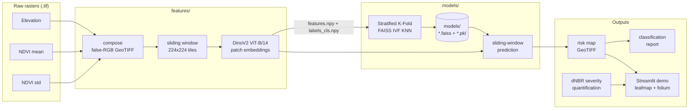

# datatonFach — Wildfire Risk from Satellite Imagery

Pipeline that turns multi-band satellite rasters (elevation + NDVI statistics) into
dense **DinoV2** patch embeddings, classifies fire-risk severity with a **FAISS KNN**,
and reconstructs a pixel-level risk map for the full raster. Built for the FACh
(Fuerza Aérea de Chile) datathon on wildfire analytics over Valparaíso and US regions.

> **Stack:** Python 3.10 · PyTorch · DinoV2 (ViT) · FAISS · scikit-learn · rasterio · Streamlit · uv · ruff · pytest · GitHub Actions

## What it does

1. **Compose** a false-RGB GeoTIFF from three physical signals — *elevation*,
   *NDVI mean*, *NDVI std* — so a vision model can exploit them as image channels.
2. **Featurize** each 224×224 tile with a frozen **DinoV2 ViT-B/14**, keeping dense
   patch embeddings (no fine-tuning).
3. **Train** a FAISS IVF KNN over the embeddings with stratified k-fold CV against
   bbox-annotated fire-risk classes (`high`, `very_high`, `moderate`, `low`,
   `very_low`, `non-burnable`, `water`).
4. **Predict** over arbitrarily large rasters via sliding-window tiling and stitch
   the output back into a georeferenced class map.
5. **Quantify** burn severity post-fire from **dNBR** rasters (Landsat pre/post).
6. **Serve** an interactive **Streamlit** demo that renders predictions and burn
   quantification on a Leaflet map.

## Architecture



## Project layout

```
src/datatonfach/
  config.py              # ROOT / DATA_DIR / MODELS_DIR paths
  io/geo.py              # rasterio load/save + axis helpers
  features/
    input_images.py      # false-RGB composition
    featurizer.py        # DeepFeaturizer (DinoV2, CPU/GPU-safe)
    dataset.py           # (features.npy, labels_cls.npy) builder
  models/
    knn.py               # FaissKNeighbors, FaissKMeans
    sliding_window.py    # patchify / unpatchify
    train.py             # stratified k-fold training + metrics
    predict.py           # full-raster prediction pipeline
  eval/
    validation.py        # bbox-based classification report
    pixels_count.py      # dNBR severity quantification
  cli.py                 # typer entry point
interface/               # Streamlit demo
tests/                   # pytest smoke tests
.github/workflows/ci.yml # ruff + pytest on every push
```

## Install

```bash
git clone git@github.com:sebastianbreguel/datatonFach.git
cd datatonFach
uv sync --extra dev
uv run pre-commit install
```

Data + pretrained weights: [Google Drive](https://drive.google.com/file/d/1XkLBKegO08jcm0mbODx3u-xBhpsu4dod/view?usp=sharing)
(place under `./data/` and `./models/`). For GPU DinoV2 inference install the matching
PyTorch CUDA build from [pytorch.org](https://pytorch.org/get-started/locally/).

## Usage

```bash
uv run datatonfach compose                       # build composed.tif per folder
uv run datatonfach featurize --backbone base     # DinoV2 embeddings + labels
uv run datatonfach train --k 11 --n-splits 5     # stratified k-fold KNN
uv run datatonfach predict                       # risk map over valpo/composed.tif
uv run datatonfach validate                      # classification report vs bbox GT
uv run streamlit run interface/app.py            # interactive demo
```

Trained artifacts → `./models/`, predictions → `./data/predictions/`.

## Dev workflow

```bash
uv run ruff check .          # lint
uv run ruff format .         # format (line length 140, double quotes)
uv run pytest                # tests
uv run pre-commit run --all-files
```

CI runs ruff + pytest on every push/PR (`.github/workflows/ci.yml`).

## Team

Luis Aros Illanes · Andrés Sebastián de la Fuente · Lucas Carrasco Estay ·
Benjamín Henríquez Soto · Sebastián Breguel González · Martín Bravo Díaz

## License

MIT — see [LICENSE](LICENSE).
